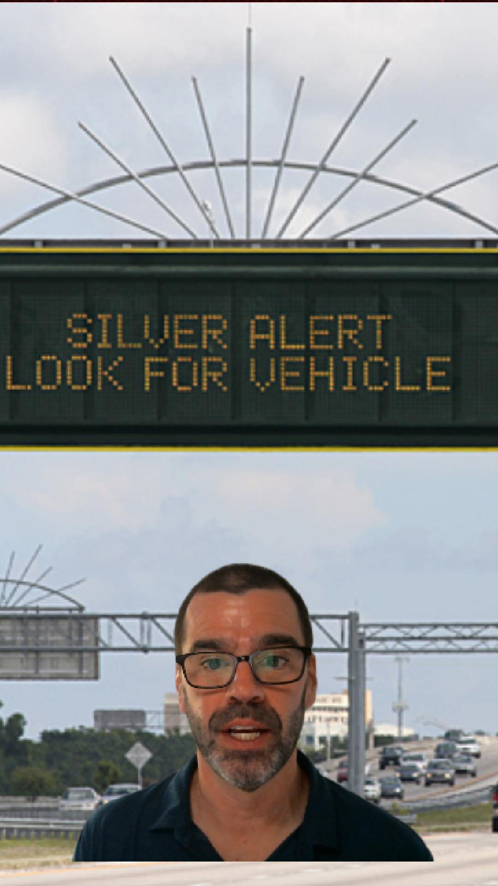

# Florida Alerts: do Silver Alerts actually find people?

A Silver Alert on a highway sign over US-1 in Miami prompted a simple question: do those alerts ever work, and do they actually find the person?

This folder is the behind-the-scenes companion to David the Data Dude's [Instagram Reel](https://www.instagram.com/reel/DePwOM8S0_S/) on the question.

  
   
  <b>▶ <a href="https://www.instagram.com/reel/DePwOM8S0_S/">Watch the Reel on Instagram</a></b>

The Reel runs 2:58. Here's everything behind it: the data, the code, every chart, and the long list of things that got in the way.

## The finding

**Almost everyone is found, and the alert itself gets the credit about 1 time in 10.**

| | Figure | Source |
|---|---|---|
| State Silver Alerts per year, 2011–2021 | 162 to 287 | FDLE monthly reports (2011–2020), MEPIC newsletter (2021) |
| People found, per 100 Silver Alerts | **98** (527 of 536, 2020–2021) | MEPIC newsletters |
| Found *because of the alert*, per 100 | **11** (222 of 2,070, 2012–2020) | FDLE monthly reports |
| Same, FDLE's running total since 2008 | about 9.4% ("more than 300" of "more than 3,200", October 2023) | FDLE press release |

**When the alert does work, it's usually an ordinary person.** In FDLE's 197 published success stories (2014–2022):
- A citizen spotted the missing person in 107, police in 84.
- Counting the stories that say how the person was spotted, public alerts beat the police-only BOLO 63 to 54 (highway signs 49, lottery terminals 14).
- 168 of 2,219 people under a state Silver Alert (2011–2020) were found outside Florida, in 22 other states, as far away as Puyallup, Washington.

## Definitions

**State Silver Alert.** Issued statewide by the Florida Department of Law Enforcement (FDLE) for a missing person with dementia who is traveling in a vehicle with a known plate, after police have issued a local alert. The alert goes out on highway message signs, lottery terminals and email/text. Every Silver Alert number here counts state alerts only; local Silver Alerts (people missing on foot) aren't included.

**Direct and indirect recovery.** These are FDLE's terms, not ours. Its monthly reports define them this way:

> A direct recovery is defined as a person recovered due to the activation of the State Silver Alert, primarily through the use of dynamic highway message signs or other actions initiated by state agencies. An indirect recovery is defined as a person recovered through the actions of the local agency in coordination with the Silver Alert Plan, primarily through law enforcement communications or media.

FDLE changed this definition over time. Before July 2011, its "direct" count appears to have included what it later called indirect: the old total of 45 dropped to 30 direct plus 17 indirect. By 2023, its newsletters counted police finding someone through the BOLO as direct, too. FDLE also says its count is a floor, because agencies don't always report back.

**Who spotted them, and how they knew** (our labels, on FDLE's success stories). Simple keyword rules, applied to each story's text in [`scripts/parse_success_stories.py`](scripts/parse_success_stories.py). The first rule that matches wins:
- **Who:** the person themself ("recognized himself/herself"), family, a citizen (clerk, motorist, employee, hospital worker…), law enforcement (deputy, officer, trooper, Highway Patrol…), otherwise unclear.
- **How:** plate reader, highway message sign, police BOLO, media, social media, text/email alert, lottery terminal, otherwise unspecified. 79 of 197 stories just say the person was recognized "from the Silver Alert".

## What's in the Reel

| Clip | What it shows |
|---|---|
| [`card5-years-dots.mp4`](videos/card5-years-dots.mp4) | State Silver Alerts per year (2011–2021), then 100 dots: 98 found, 11 of them because of the alert |
| [`card6-found-by.mp4`](videos/card6-found-by.mp4) | Who spotted them: citizen 107, police 84, the person themself 3, unclear 2, family 1 |
| [`card7-channels.mp4`](videos/card7-channels.mp4) | How they knew: public alerts (highway signs 49 + lottery terminals 14) vs. the police BOLO (54) |
| [`card8-map.mp4`](videos/card8-map.mp4) | Where people were found: Florida 2,035, Georgia 82, then 21 more states, out to Puyallup, WA |
| [`card9-takeaways.mp4`](videos/card9-takeaways.mp4) | The takeaway lines |

## What we left on the cutting-room floor

- **AMBER Alerts do about twice as well.** Nationally, 780 of 3,638 AMBER Alerts (21.4%, 2006–2024) found the child as a direct result. In Florida, FDLE reports 77 of 269 since 2000 (29%). The definitions differ by source, so this is a rough comparison. See [`data/amber_national_yearly.csv`](data/amber_national_yearly.csv).
- **All alert types together:** 38 of 301 alerts in 2020, 31 of 345 in 2021 and 51 of 480 in 2023 were direct recoveries, about 9–13% ([`data/alerts_yearly_direct.csv`](data/alerts_yearly_direct.csv)).
- **FDLE and the national center never agree** on how many AMBER Alerts Florida issued: off by one or two in every year from 2020 to 2023.
- **FDLE seems to have stopped counting indirect recoveries.** The running total sits at 45 from mid-2017 to the end of 2020.

## How we did it

1. **Found the sources.** FDLE's site lists only today's active alerts. Its Silver Alert "Monthly Reports" page was empty after a site redesign, and its newsletter archive was a broken frame.
2. **Recovered the lost reports from the Internet Archive.** The Wayback Machine's index listed 120 monthly-report PDFs (2011–2020). We downloaded them one at a time, a few seconds apart, and got 119; the Archive can't serve October 2012. See [`scripts/wayback_index.py`](scripts/wayback_index.py) and [`wayback_download.py`](scripts/wayback_download.py).
3. **Found unlinked newsletters** by trying FDLE's `/MEPIC/Documents/<year>-<season>` URL pattern, which turned up 13 issues.
4. **Parsed ten years of PDF tables.** FDLE's table template changed constantly, in at least seven ways (row numbers without a period, age and sex written backwards, wrapped names…). Every fix was checked by diffing the old output against the new. See [`scripts/parse_silver_monthly.py`](scripts/parse_silver_monthly.py).
5. **Typed the newsletter figures by hand,** each with its page and exact quote, because the stat boxes mix spelled-out numbers, partial years and running totals. A script checks every quote against the source text ([`scripts/check_newsletter_stats.py`](scripts/check_newsletter_stats.py)).
6. **Extended the series to 2023** with FDLE's October anniversary press releases. The 2015 release matches FDLE's own September 2015 report exactly.
7. **Checked by hand.** 13 spot checks against the original PDFs passed and none failed; a few couldn't be finished when the Internet Archive started returning "too many requests" ([`docs/spot-checks.md`](docs/spot-checks.md)).
8. **Drew the charts in code** with [Remotion](https://www.remotion.dev), [rough.js](https://roughjs.com) and [d3-geo](https://github.com/d3/d3-geo), timed frame by frame to the recording. See [`video/`](video/).

The full story of what went wrong is in [`docs/data-challenges.md`](docs/data-challenges.md): 34 entries, from FDLE quietly redefining "direct" to two official sources that never agree.

## What's in this folder

| Path | Contents |
|---|---|
| [`data/silver_alerts_yearly.csv`](data/silver_alerts_yearly.csv) | **The headline table:** state Silver Alerts and direct recoveries per year, 2011–2020 |
| [`data/silver_cumulative.csv`](data/silver_cumulative.csv) | Every running total FDLE published, 2012 to October 2023, with its source |
| [`data/silver_alert_cases_2011_2020.csv`](data/silver_alert_cases_2011_2020.csv) | 2,219 state Silver Alerts, one per row: year, month, age, sex, agency, the state where the person was found, and FDLE's direct/indirect mark |
| [`data/silver_monthly_totals.csv`](data/silver_monthly_totals.csv) | The totals printed at the bottom of each monthly report |
| [`data/silver_success_stories.csv`](data/silver_success_stories.csv) | FDLE's 197 success stories (2014–2022), with our who/how labels |
| [`data/silver_recovery_states.csv`](data/silver_recovery_states.csv) | Where people were found, by state |
| [`data/newsletter_stats.csv`](data/newsletter_stats.csv), [`data/silver_anniversary_releases.csv`](data/silver_anniversary_releases.csv) | Hand-typed figures from FDLE's newsletters and press releases, each with its source and exact quote |
| [`data/alerts_yearly_by_type.csv`](data/alerts_yearly_by_type.csv), [`data/alerts_yearly_direct.csv`](data/alerts_yearly_direct.csv), [`data/amber_national_yearly.csv`](data/amber_national_yearly.csv) | AMBER, Missing Child and Purple Alert figures (background; not in the Reel) |
| [`data/chart-data/`](data/chart-data/) | The exact numbers the charts draw |
| [`scripts/`](scripts/) | The Python pipeline: find and download the sources, parse, build the tables, export the chart data |
| [`docs/`](docs/) | Data challenges (the "inside look"), a then-vs-now comparison with 2021 ([`back-in-my-day.md`](docs/back-in-my-day.md)), spot checks and the difficulty rubric |
| [`video/`](video/), [`videos/`](videos/) | The Remotion project, and the five rendered charts (1080×1920 MP4) |

**Degree of difficulty: 6/10.** Hard to get, easy to count. All PDFs, no single complete source, and data that stops in 2020. But once the numbers were out, counting them was simple. See the [rubric](docs/difficulty-rubric.md).

## What's not here, and why

- **The raw PDFs and web pages.** They're FDLE's, NCMEC's and the Internet Archive's to host. The scripts show where each one came from.
- **Exact dates and towns for each alert.** FDLE's reports print them, but a day, a town and an age together can point to one person, so the case table stops at year and month, and at the state where the person was found. No names appear anywhere: the reports carry none, and we didn't collect any.

The scripts expect the private working copy's folder layout and downloaded files, so they're here to read rather than run end to end. The chart code does run: `cd video && npm install && npm run studio`.

## Caveats

- **"Found because of the alert" is a floor,** in FDLE's own words, and its definition changed over the years.
- **The 98 and the 11 come from different years** (2020–2021 and 2012–2020), because no single source gives both.
- **The success stories are the ones FDLE chose to publish,** not every recovery.
- **Nothing on direct recoveries has been published since October 2023,** and the monthly reports end in 2020.

## Credits

- Silver Alert reports, newsletters, success stories and press releases: [Florida Department of Law Enforcement](https://www.fdle.state.fl.us/mepic) and its Missing Endangered Persons Information Clearinghouse (MEPIC). The Summer 2026 newsletter was published by the [Florida Missing Children's Day Foundation](https://www.fmcdf.org).
- Archived reports: the [Internet Archive's Wayback Machine](https://web.archive.org).
- National AMBER Alert reports: the [National Center for Missing & Exploited Children](https://www.missingkids.org), published by the [U.S. Department of Justice](https://amberalert.ojp.gov/statistics).
- Charts: [Remotion](https://www.remotion.dev), [rough.js](https://roughjs.com), [d3-geo](https://github.com/d3/d3-geo) and [us-atlas](https://github.com/topojson/us-atlas).

## License

Our code, docs, charts and labels are under the repo's [MIT License](../LICENSE). The figures and quoted text drawn from FDLE, FMCDF and NCMEC/DOJ reports belong to those publishers and are reproduced here for reference.
