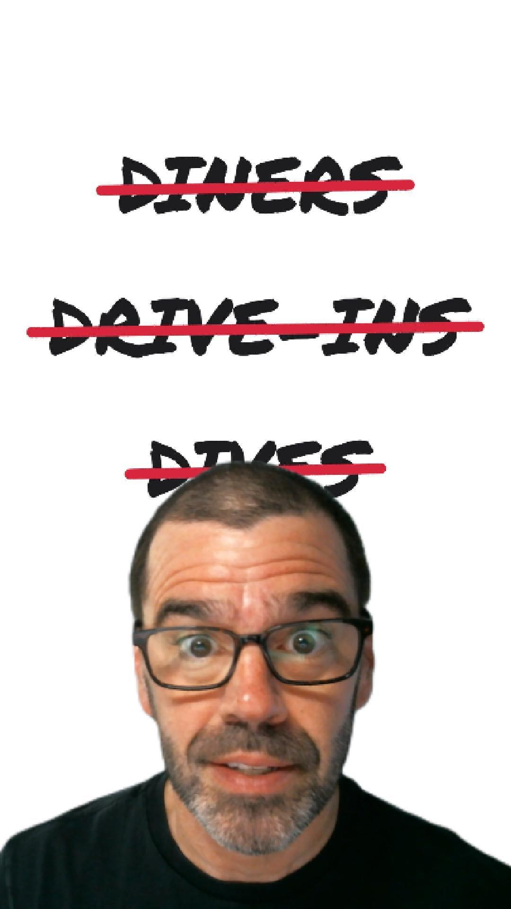

# Triple D: Diner, Drive-In, Dive, or none of the above?

*Diners, Drive-Ins and Dives* has featured about 1,600 restaurants over 43 seasons. How many of them are actually diners, drive-ins or dives?

This folder is the behind-the-scenes companion to David the Data Dude's [Instagram Reel](https://www.instagram.com/reel/DeK1SQpS-qs/) on the question.

  
   
  <b>▶ <a href="https://www.instagram.com/reel/DeK1SQpS-qs/">Watch the Reel on Instagram</a></b>

The Reel is under 3 minutes, so most of the work didn't make the cut. Everything is here: the data, the code, the AI classifier's raw answers, every chart, and the things we got wrong along the way.

## The finding

**Triple D has drifted away from its own title.** Among the 1,560 US restaurants featured in seasons 1–43 (2007–2026):

| | First 10 seasons | Last 10 seasons |
|---|---|---|
| Diners | 35% | 4% |
| Dives | 19% | 6% |
| Drive-Ins | 7% | 6% |
| **Global kitchens + Mexican & Latin** | **13%** | **32%** |

- In season 1, 92% of the restaurants were diners, drive-ins or dives. In season 43 it was 13%, and the low point was season 41, at 6% (2 of 36).
- Overall, 1,033 of the 1,560 (66%) fit none of the three categories.
- What replaced them: global kitchens (207), Mexican & Latin (161), pizza & Italian (123), New American bistros (107), BBQ (99) and more.

That's consistent with America's broader shift toward global flavors, but note what this data measures: it shows what the show's producers chose to feature, not what diners ordered.

## How we defined a diner, drive-in and dive

There's no official definition of any of the three, so we wrote our own. These are the exact words the AI classifier was given (definitions version v2, also in [`data/definitions.json`](data/definitions.json)):

> **Diner:** A casual, sit-down American eatery built around comfort food and quick table or counter service: counter seating or booths, breakfast served (often all day), short-order cooking, burgers, sandwiches, blue-plate specials. Includes classic chrome/railcar diners, luncheonettes, coffee shops, and family cafes serving breakfast and lunch.

> **Drive-In:** A place where food is ordered at a window, counter, or from a car and is typically eaten in the car, outdoors, or taken away: carhop drive-ins, drive-thrus, walk-up stands, roadside shacks, dairy bars, burger stands, and food trucks or carts. Little or no indoor table service.

> **Dive:** An unpretentious, no-frills joint with a gritty or worn-in character: a bar, tavern, or pub that serves food, or a tiny hole-in-the-wall eatery in an unremarkable location (strip mall, gas station, back of a market), including hole-in-the-wall taquerias and taco shops. Locals' spot, cheap, casual, often cash-only or quirky decor.

> **Other:** Does not fit Diner, Drive-In, or Dive: for example a full-service or upscale restaurant, bistro, brewery taproom, deli or market counter, bakery, pizzeria, BBQ or ethnic restaurant with conventional table service and no dive-like character.

Two notes on how these were applied:
- **Names come first.** A restaurant with "Diner", "Drive-In" (or "Drive-Thru") or "Dive" in its name gets that label automatically, before the AI weighs in.
- **The definitions changed once.** The first version of Dive didn't mention taquerias. After a spot-check, we broadened it to include hole-in-the-wall taquerias and taco shops, and re-ran every restaurant.

"Dive" is the hardest call. It's mostly about atmosphere and neighborhood, while the descriptions the AI read are mostly about food.

## What's in the Reel

| Clip | What it shows | Data |
|---|---|---|
| [`ddd-strike.mp4`](videos/ddd-strike.mp4) | DINERS / DRIVE-INS / DIVES written out, then each struck through in red | Text only |
| [`hook-line.mp4`](videos/hook-line.mp4) + [still](videos/stills/hook-line.png) | Share of each season's restaurants that are diners, drive-ins or dives, falling from 92% (season 1) to 13% (season 43) | US only |
| [`d-words.mp4`](videos/d-words.mp4) + [still](videos/stills/d-words.png) | "D-WORDS" scoreboard: DAVID vs. TRIPLE-D. ("DIVE-INS" is a deliberate blooper, kept from the taping.) | Text only |
| [`category-morph.mp4`](videos/category-morph.mp4) | The 4-category bar chart, with "Other" breaking apart into the 12 kinds of restaurant it's made of | US only |
| [`then-now-slope-combined.mp4`](videos/then-now-slope-combined.mp4) + [still](videos/stills/then-now-slope-combined.png) | First 10 vs. last 10 seasons: Diners and Dives fall, Drive-Ins hold flat, Global & Latin rises | US only |

The Reel used a file named `hook-line-new.mp4`. It's identical to `hook-line.mp4` here; it was a temporary name while the original file was locked.

## What we left on the cutting-room floor

**Charts we made but didn't use** (all in [`videos/`](videos/), all US only):

| Clip | What it shows |
|---|---|
| `hook-line-steps.mp4` | The hook, slowed down: 92% → 80% → 64% with pauses, then the rest |
| `category-bars-jev.mp4` | Diner / Drive-In / Dive / Other as vertical bars |
| `category-bars-forced.mp4` | "If Guy had to pick": every restaurant forced into one of the three D's |
| `category-bars-detailed.mp4` | The 15-category breakdown on its own (also the last frame of `category-morph`) |
| `season-stack.mp4`, `season-stack-100.mp4` | Every season stacked by category, as counts and as 100% |
| `season-stack-100-detailed.mp4` | Same, with all 12 "Other" buckets in their own colors |
| `season-stack-100-simple.mp4` | Same, simplified to 7 categories |
| `era-stack-100-simple.mp4` | "Then vs. now": four season groups as 100% stacked bars |
| `then-now-slope.mp4` | First 10 vs. last 10: Diner vs. Global kitchens alone |
| `then-now-seasons.mp4` | Those lines through all 43 seasons (noisy, but honest) |
| `then-now-endpoints.mp4` | Season 1 vs. season 43 as raw counts ("22 to 1") |

**Findings we didn't have time for:**
- **At least 23% have closed.** 365 of the 1,560 US restaurants are out of business, as far as our sources know. That's a floor, because a closure is only counted when a source records it.
- **208 restaurants were featured more than once,** and 24 of them three times.
- **The "if Guy had to pick" version:** forced to choose, Jev calls 500 Dives, 457 Diners and 154 Drive-Ins, but it still can't place 449 restaurants. Those stay "Other".
- **Trips abroad:** the show also visited Italy (twice), Cuba, Spain, the UK, Mexico and Canada. We left those 74 restaurants out, since the story is about American tastes. The trend is the same with or without them.
- **How we checked the work,** and where the method is weakest: see [`docs/`](docs/).

## How we did it (what the Reel didn't explain)

1. **Built the list.** The season and episode lists and air dates come from [Wikipedia](https://en.wikipedia.org/wiki/List_of_Diners,_Drive-Ins_and_Dives_episodes). Wikipedia numbers the seasons 1–44; we stopped at 43 because 44 was still airing. Restaurant descriptions and open/closed status come from [foodiepie.com](https://www.foodiepie.com), one fan's hand-built database covering about 83% of the restaurants.
2. **Scraped politely.** [`scripts/fetch.py`](scripts/fetch.py) fetched about 1,500 pages at one per second. Every page was cached and downloaded once, and both sites' robots.txt allow it. foodiepie hides closed restaurants behind a toggle, so we downloaded its list twice and compared the two.
3. **Matched the two lists.** [`scripts/match.py`](scripts/match.py) does this. The two sources spell names differently ("BBQ" vs. "Barbeque", "&" vs. "and", revisits under new names), so we matched by name and state, with fuzzy rules and a hand-made fix for one Wikipedia typo.
4. **Researched the gaps.** About 280 restaurants weren't on foodiepie, so AI research agents looked each one up and wrote short summaries in their own words. One honest mistake: when the agents hit a search limit, some loaded Bing and DuckDuckGo results pages directly, which Bing's robots.txt forbids. We re-researched those 37 restaurants using only legitimate search.
5. **Classified with an AI.** [TypeSafe's Jev](https://docs.typesafe.ai) (`jev-1.13.0`) read each restaurant's description and picked Diner, Drive-In, Dive or Other, using definitions we wrote ([`data/definitions.json`](data/definitions.json)). Names settle some cases outright: anything called "...Diner" is a Diner. A second question then sorted each "Other" into one of 12 buckets. All 5,605 Jev calls, including test runs, cost **$0.24** in total.
6. **Checked by hand.** We spot-checked 14 results against the real world ([`docs/spot-checks.md`](docs/spot-checks.md)) and fixed the two that were wrong: La Santisima (Phoenix) burned down in 2025, and Jake's Good Eats (Charlotte) is a dive in a converted gas station.
7. **Drew the charts in code.** [Remotion](https://www.remotion.dev) turns React components into video. [rough.js](https://roughjs.com) supplies the hand-drawn marker strokes and the Permanent Marker font supplies the handwriting. See [`video/`](video/).

## What's in this folder

| Path | Contents |
|---|---|
| [`data/triple_d_restaurants.csv`](data/triple_d_restaurants.csv) | **The main table**, one row per restaurant (1,634; filter `in_us` for the 1,560 US ones): category (strict, forced and detailed), Jev's 0–1 scores, air dates, seasons, open/closed, country |
| [`data/jev_output.csv`](data/jev_output.csv) | Jev's raw answers per restaurant: choice, confidence, all probabilities, the three yes/no scores and the "Other" bucket |
| [`data/definitions.json`](data/definitions.json) | The exact definitions and questions Jev was given |
| [`data/wiki_appearances.csv`](data/wiki_appearances.csv) | Every restaurant appearance, parsed from Wikipedia (CC BY-SA 4.0) |
| [`data/chart-data/`](data/chart-data/) | The numbers behind the charts: US only (`triple-d.json`), plus an all-countries version for comparison |
| [`scripts/`](scripts/) | The Python pipeline, in run order: fetch → parse → match → classify → classify_buckets → build_final → make_chart_data |
| [`docs/`](docs/) | Data challenges (the "inside look"), spot-checks, ways to improve, a then-vs-now comparison and the difficulty rubric |
| [`video/`](video/) | The Remotion project that draws every chart |
| [`videos/`](videos/) | Every rendered chart (1080×1920 MP4) and a [still](videos/stills/) of each one's final frame |

**Degree of difficulty: 6/10.** The data was easy to get but hard to label; see the [rubric](docs/difficulty-rubric.md).

## What's not here, and why

- **foodiepie's restaurant descriptions and Yelp's categories.** Jev read them, but they're other people's work. We publish the facts and our labels, not their writing.
- **The raw scraped pages and the AI agents' research notes.**
- **API keys.** The classifier scripts read `TYPESAFE_API_KEY` from your environment.

The scripts expect the private working copy's folder layout and cached pages, so they're here to read rather than run end to end. The chart code does run: `cd video && npm install && npm run studio`.

## Caveats

- **The categories are our definitions,** and judgment calls. A "dive" is about atmosphere, and the descriptions mostly talk about food.
- **Jev's labels have no accuracy score.** The spot-checks are a sanity check, not a measurement.
- **"Open" means no source records a closure.**
- **Season 1 and season 43 are about 36 restaurants each,** so single-season numbers move a lot. Trust the season-group comparisons more.

## Credits

- Episode data: Wikipedia contributors, [List of *Diners, Drive-Ins and Dives* episodes](https://en.wikipedia.org/wiki/List_of_Diners,_Drive-Ins_and_Dives_episodes) (CC BY-SA 4.0).
- Restaurant details: [foodiepie.com](https://www.foodiepie.com), 15 years of one person's TV-watching. Thank you.
- Classification: [TypeSafe Jev](https://typesafe.ai). Charts: [Remotion](https://www.remotion.dev) and [rough.js](https://roughjs.com).

## License

The code, docs, charts and our own labels are under the repo's [MIT License](../LICENSE). Wikipedia-derived data ([`data/wiki_appearances.csv`](data/wiki_appearances.csv), plus the seasons and air dates in [`data/triple_d_restaurants.csv`](data/triple_d_restaurants.csv)) remains under [CC BY-SA 4.0](https://creativecommons.org/licenses/by-sa/4.0/): reuse it with attribution, and share adaptations under the same license.
